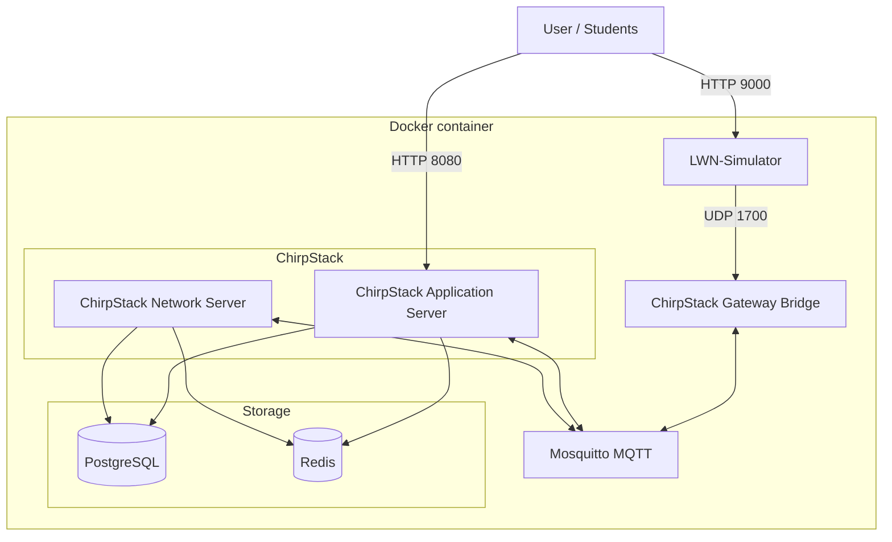
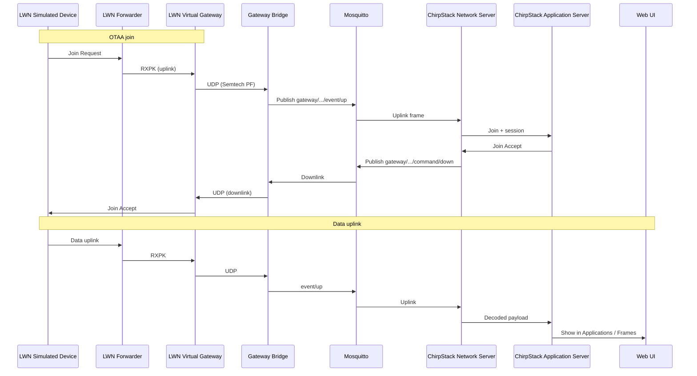
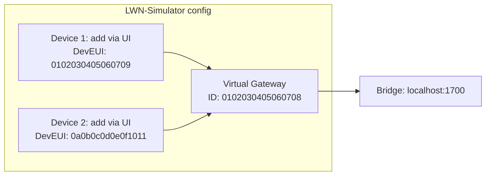
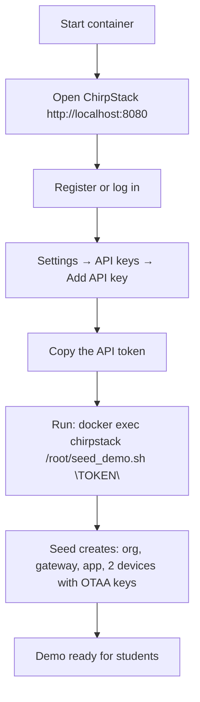
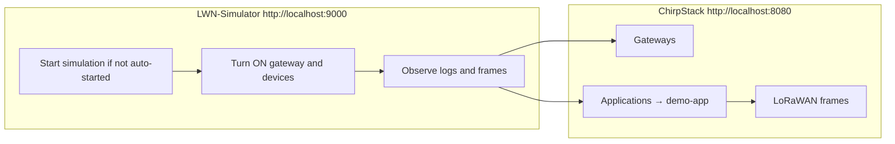

# ChirpStack Backend

A Docker-based deployment of the **ChirpStack** LoRaWAN network stack with **LWN-Simulator** integration, suitable for teaching and demos. The setup includes ChirpStack Network Server, ChirpStack Application Server, ChirpStack Gateway Bridge, PostgreSQL, Redis, Mosquitto MQTT broker, and LWN-Simulator with pre-configured virtual gateways and OTAA devices.

---

## Table of Contents

- [Overview](#overview)
- [Architecture](#architecture)
- [Prerequisites](#prerequisites)
- [Installation](#installation)
- [Configuration](#configuration)
- [Student Demo Environment](#student-demo-environment)
- [Usage](#usage)
- [Ports Reference](#ports-reference)
- [Troubleshooting](#troubleshooting)
- [Support and Contributions](#support-and-contributions)

---

## Overview

This repository provides:

- **ChirpStack** (Network Server + Application Server) for managing LoRaWAN gateways, applications, and devices.
- **ChirpStack Gateway Bridge** to accept UDP packet-forwarder traffic (e.g. from LWN-Simulator) and publish to MQTT.
- **LWN-Simulator** with a ready-to-use demo: one virtual gateway (pre-configured) and two OTAA devices that you add in the LWN UI (same DevEUI/AppKey as in ChirpStack after the seed) so they talk to ChirpStack through the gateway bridge.

After a one-time seed step and adding the two devices in LWN-Simulator, students can run the simulation and observe join requests, uplinks, and downlinks in the ChirpStack web UI.

---

## Architecture

### System architecture

All services run inside a single Docker container. The diagram below shows the main components and how they connect.



- **PostgreSQL**: databases for Network Server (`chirpstack_ns`) and Application Server (`chirpstack_as`).
- **Redis**: used by both ChirpStack components for caching and queues.
- **Mosquitto**: MQTT broker; Network Server and Application Server subscribe/publish here; Gateway Bridge publishes gateway events and receives commands.
- **ChirpStack Gateway Bridge**: listens on UDP port 1700 (Semtech packet-forwarder protocol), converts to MQTT messages consumed by the Network Server.
- **LWN-Simulator**: simulates LoRaWAN devices and a virtual gateway that sends UDP to the Gateway Bridge.

### LoRaWAN demo data flow (student scenario)

When the LWN-Simulator runs, simulated devices send uplinks; the virtual gateway forwards them to the Gateway Bridge, which then publishes to MQTT. ChirpStack Network Server processes the frames and the Application Server exposes them in the web UI.



---

## Prerequisites

- **Docker**: required to build and run the container.
- **Git**: optional; only needed if you clone the repository (you can also download the archive).

---

## Installation

### 1. Clone or download the repository

```bash
git clone https://github.com/lucadagati/Chirpstack_BackEnd.git
cd Chirpstack_BackEnd
```

### 2. Build the Docker image

```bash
docker build -t chirpstack-complete .
```

This creates the image `chirpstack-complete`. You can change the name by adjusting the `-t` value.

### 3. Start the container

Map the required ports so you can access the web UIs and MQTT from the host:

```bash
docker run -dit --restart unless-stopped --name chirpstack \
  -p 8080:8080 \
  -p 1883:1883 \
  -p 9000:9000 \
  chirpstack-complete
```

- **8080**: ChirpStack web interface.
- **1883**: Mosquitto MQTT (use `-p 1884:1883` if 1883 is already in use on the host).
- **9000**: LWN-Simulator web interface.

Replace `chirpstack` with any container name you prefer.

---

## Configuration

The following configuration files are used inside the container; you can rebuild the image with modified copies if needed:

| Component              | Config path (inside container) |
|------------------------|--------------------------------|
| ChirpStack Network Server | `/etc/chirpstack-network-server/chirpstack-network-server.toml` |
| ChirpStack Application Server | `/etc/chirpstack-application-server/chirpstack-application-server.toml` |
| ChirpStack Gateway Bridge | `/etc/chirpstack-gateway-bridge/chirpstack-gateway-bridge.toml` |
| Mosquitto              | `/etc/mosquitto/mosquitto.conf` |
| LWN-Simulator          | `/LWN-Simulator/config.json` and `/LWN-Simulator/lwnsimulator/*.json` |

Edit these according to your network and region (e.g. band EU868 is set in the Network Server config).

---

## Student Demo Environment

The image includes a **pre-configured demo** so that, after a one-time ChirpStack seed, students can immediately run a LoRaWAN simulation and see frames in ChirpStack.

### What is pre-configured



- **LWN-Simulator**
  - **Bridge address**: `localhost:1700` (ChirpStack Gateway Bridge).
  - **One virtual gateway**: name "Demo Gateway", ID `0102030405060708` (pre-configured).
  - **Two OTAA devices**: not pre-loaded; add them in the LWN-Simulator web UI (see [Adding the demo devices in LWN-Simulator](#adding-the-demo-devices-in-lwn-simulator)) so they match ChirpStack after the seed. Use DevEUI and AppKey below.
  - **Shared AppKey** (both devices): `2b7e151628aed2a6abf7158809cf4f3c`.
- **Auto-start**: the simulation starts automatically when the container starts (`autoStart: true` in `config.json`). To start it manually from the LWN web UI instead, set `autoStart: false` in the Dockerfile and rebuild.

#### Adding the demo devices in LWN-Simulator

After ChirpStack has been seeded, add two OTAA devices in the LWN-Simulator UI so they match the devices created in ChirpStack:

| Parameter   | Device 1 (e.g. "Temperature Sensor") | Device 2 (e.g. "Humidity Sensor") |
|------------|----------------------------------------|------------------------------------|
| **Name**   | Sensore Temperatura                    | Sensore Umidità                    |
| **DevEUI** | `0102030405060709`                     | `0a0b0c0d0e0f1011`                 |
| **AppKey** | `2b7e151628aed2a6abf7158809cf4f3c`     | `2b7e151628aed2a6abf7158809cf4f3c` |
| **Region** | EU868                                  | EU868                              |

Create each device in LWN-Simulator (Devices → Add) with the above values. Leave DevAddr / NwkSKey / AppSKey as zero for OTAA; they are assigned after join.

For the demo to work, ChirpStack must have the **same** organization, gateway ID, application, and devices (same DevEUI and OTAA keys). The seed script does that in one go.

### First-time setup workflow (run once per deployment)

Run this workflow **once** after the first time you start the container (or after resetting ChirpStack data).



**Steps in detail:**

1. **Start the container** (if not already running):
   ```bash
   docker run -dit --restart unless-stopped --name chirpstack \
     -p 8080:8080 -p 1883:1883 -p 9000:9000 chirpstack-complete
   ```

2. **Open ChirpStack**: go to **http://localhost:8080** and **register** (or log in). The first user can act as admin.

3. **Create an API key**: in ChirpStack go to **Settings** → **API keys** → **Add API key**. Copy the generated token.

4. **Run the seed script** (replace `YOUR_API_TOKEN` with the token you copied):
   ```bash
   docker exec chirpstack /root/seed_demo.sh "YOUR_API_TOKEN"
   ```
   The script creates:
   - Organization "Demo per studenti" (display name)
   - Gateway "Demo Gateway" with ID `0102030405060708`
   - Application "demo-app"
   - A device profile (EU868, OTAA)
   - Two devices with the same DevEUI and AppKey as in LWN-Simulator

After this, the demo is ready: students can use LWN-Simulator and ChirpStack without further setup.

### Student workflow (using the demo)



1. **ChirpStack (http://localhost:8080)**  
   - **Gateways**: check that "Demo Gateway" appears and receives traffic.  
   - **Applications** → **demo-app**: open each device and check **LoRaWAN frames** for join requests and uplinks.

2. **LWN-Simulator (http://localhost:9000)**  
   - Bridge address is already set to `localhost:1700`.  
   - Add the two demo devices (see [Adding the demo devices in LWN-Simulator](#adding-the-demo-devices-in-lwn-simulator)) if not already present.  
   - If auto-start is disabled, click **Start** to run the simulation.  
   - Turn **ON** the gateway "Demo Gateway" and the two devices.  
   - Devices will perform OTAA join and then send periodic uplinks; corresponding frames will appear in ChirpStack.

3. **MQTT (optional)**  
   To inspect gateway events on MQTT (e.g. if mapped to host port 1883 or 1884):
   ```bash
   mosquitto_sub -h localhost -p 1883 -t 'gateway/#' -v
   ```

---

## Usage

- **ChirpStack web UI**: **http://localhost:8080** — manage organizations, gateways, applications, devices, and view LoRaWAN frames.
- **LWN-Simulator web UI**: **http://localhost:9000** — run the simulation, turn gateways and devices on/off, change payloads.
- **MQTT**: connect to `localhost:1883` (or the host port you mapped) with any MQTT client; anonymous access is allowed by default.
- **Logs**: `docker logs chirpstack` to view container logs.

---

## Ports Reference

| Service              | Container port | Typical host mapping | Description                    |
|----------------------|----------------|----------------------|--------------------------------|
| ChirpStack Web UI    | 8080           | 8080                 | HTTP UI and API                |
| LWN-Simulator        | 9000           | 9000                 | Simulator web interface        |
| Mosquitto MQTT       | 1883           | 1883 or 1884         | MQTT broker                    |
| Gateway Bridge (UDP) | 1700           | not exposed          | Used only by LWN inside container |

---

## Troubleshooting

| Issue | What to check |
|-------|----------------|
| **Gateway not visible in ChirpStack** | Ensure the Gateway Bridge is running: `docker exec chirpstack screen -ls` (you should see `gateway-bridge`). In LWN-Simulator, the gateway must be **ON** and the bridge address must be `localhost:1700`. |
| **Devices do not join (OTAA)** | In ChirpStack, verify that the two devices have **OTAA keys** set (same AppKey as in LWN: `2b7e151628aed2a6abf7158809cf4f3c`). If you ran the seed script successfully, keys are already set. |
| **Simulation does not start** | Check logs: `docker logs chirpstack`. If you prefer to start the simulation manually from the LWN UI, set `autoStart: false` in `config.json` in the Dockerfile and rebuild the image. |
| **Port 1883 already in use** | Use `-p 1884:1883` when running the container and connect MQTT clients to port 1884 on the host. |

---

## Support and Contributions

If you encounter issues or have suggestions, please open an issue or pull request on GitHub. For community support, see the project’s communication channels.
