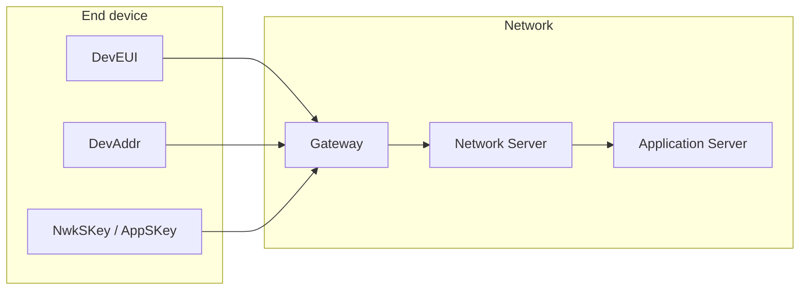
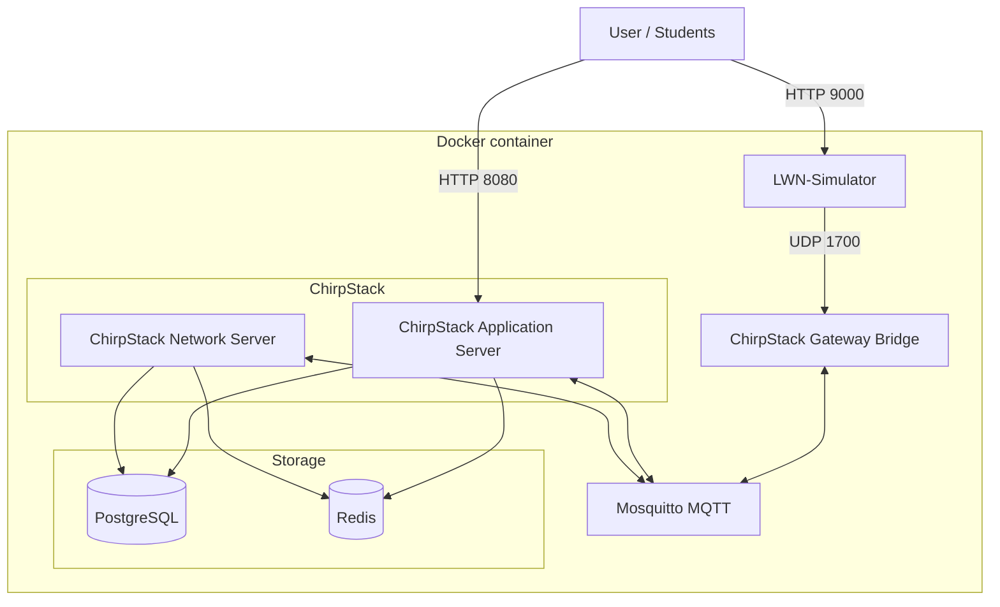
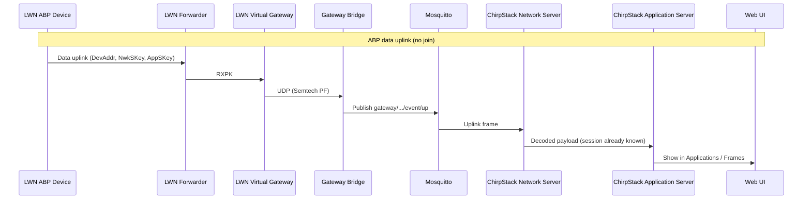
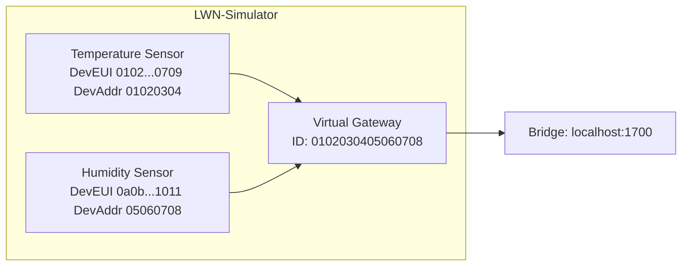
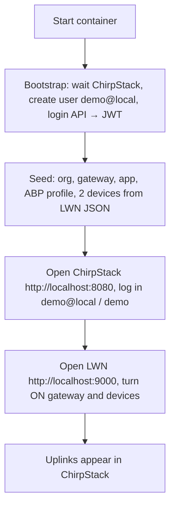
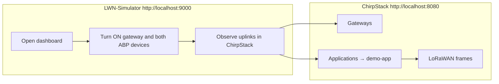

# ChirpStack Backend

A Docker-based deployment of the **ChirpStack** LoRaWAN network stack with **LWN-Simulator** integration, suitable for teaching and demos. The setup includes ChirpStack Network Server, ChirpStack Application Server, ChirpStack Gateway Bridge, PostgreSQL, Redis, Mosquitto MQTT broker, and LWN-Simulator with pre-configured virtual gateways and OTAA devices.

---

## Table of Contents

- [Overview](#overview)
- [Theory: LoRaWAN and ChirpStack](#theory-lorawan-and-chirpstack)
- [Architecture](#architecture)
- [Prerequisites](#prerequisites)
- [Installation](#installation)
- [Configuration](#configuration)
- [Student Demo Environment](#student-demo-environment)
- [Usage](#usage)
- [Ports Reference](#ports-reference)
- [Troubleshooting](#troubleshooting)
- [Support and Contributions](#support-and-contributions)

---

## Overview

This repository provides:

- **ChirpStack** (Network Server + Application Server) for managing LoRaWAN gateways, applications, and devices.
- **ChirpStack Gateway Bridge** to accept UDP packet-forwarder traffic (e.g. from LWN-Simulator) and publish to MQTT.
- **LWN-Simulator** with a ready-to-use **ABP** demo: one virtual gateway and two ABP devices (pre-configured) that send uplinks through the ChirpStack Gateway Bridge with no join step.

At first start, **bootstrap** creates a demo user and seeds ChirpStack from the LWN config (no manual registration or API key). Students log in to ChirpStack with **demo@local** / **demo**, open LWN-Simulator, turn on the gateway and devices, and see uplinks in ChirpStack.

---

## Theory: LoRaWAN and ChirpStack

### LoRaWAN in brief

**LoRa** is a proprietary physical layer (PHY) that uses Chirp Spread Spectrum (CSS) in unlicensed sub-GHz bands (e.g. 868 MHz in Europe, 915 MHz in the US). It provides long range and low power at the cost of low data rate and limited payload size.

**LoRaWAN** is the MAC/network layer defined by the LoRa Alliance. It runs on top of LoRa and defines:

- **Star-of-stars topology**: end devices talk only to gateways; gateways forward frames to a central **Network Server** (and optionally a **Join Server**). The Network Server manages device identity, security, and routing of application data to **Application Servers**.
- **Uplink vs downlink**: devices send **uplinks** (device → network); the network can send **downlinks** (network → device) for acknowledgements or commands. Downlinks are constrained by regional regulations (duty cycle, dwell time).
- **Activation**:
  - **OTAA (Over-The-Air Activation)**: device performs a **join** with the network; it uses a root key (AppKey) and receives a **DevAddr** and session keys (NwkSKey, AppSKey). More secure and recommended for production.
  - **ABP (Activation By Personalization)**: DevAddr, NwkSKey, and AppSKey are pre-configured in the device and in the network. No join; the device can send uplinks immediately. Used for testing and demos (as in this project).
- **Identifiers**: each device has a globally unique **DevEUI** (64-bit). After activation it gets a **DevAddr** (32-bit, network-local). **NwkSKey** protects and authenticates MAC commands; **AppSKey** encrypts application payloads.



### ChirpStack

**ChirpStack** is an open-source LoRaWAN network stack. Its main components are:

| Component | Role |
|-----------|------|
| **ChirpStack Network Server** | Receives uplinks from gateways (via a **Gateway Bridge**), manages device sessions (ABP/OTAA), decrypts and authenticates frames, and forwards application payloads to the Application Server. Handles join requests and downlink scheduling. |
| **ChirpStack Application Server** | Web UI and API for managing **organizations**, **gateways**, **applications**, and **devices**. Stores device metadata, integrates with external systems (e.g. MQTT, HTTP), and shows LoRaWAN frames (uplinks/downlinks) per device. |
| **ChirpStack Gateway Bridge** | Sits between gateways and the rest of the stack. Gateways speak the **Semtech packet-forwarder** protocol (UDP). The bridge converts these packets to MQTT (or gRPC) messages consumed by the Network Server. So ChirpStack can work with any gateway that implements the packet-forwarder protocol. |

In this project, **LWN-Simulator** acts as a virtual gateway plus virtual end devices: it generates LoRaWAN-like uplinks and sends them over UDP (packet-forwarder format) to the ChirpStack Gateway Bridge. That way you can try ChirpStack end-to-end without real hardware.

### How it fits together

1. **LWN-Simulator** defines virtual gateways and ABP devices (DevEUI, DevAddr, NwkSKey, AppSKey) in JSON.
2. The **bootstrap/seed** (automatic at first start, or via API token) mirrors that configuration into **ChirpStack** (same gateways and devices, with ABP activation).
3. When you turn ON a device in LWN, it sends uplinks to the virtual gateway → **Gateway Bridge** (UDP 1700) → **MQTT** → **Network Server** → **Application Server** → you see the frames in the ChirpStack UI.

---

## Architecture

### System architecture

All services run inside a single Docker container. The diagram below shows the main components and how they connect.



- **Supervisord**: processo principale (PID 1) che avvia e mantiene in esecuzione Mosquitto, ChirpStack (Network Server, Application Server, Gateway Bridge) e LWN-Simulator, con **restart automatico** in caso di crash (niente screen, gestione persistente).
- **PostgreSQL**: database per Network Server (`chirpstack_ns`) e Application Server (`chirpstack_as`), avviati dall’entrypoint prima di supervisord.
- **Redis**: usato da ChirpStack per cache e code; avviato dall’entrypoint.
- **Mosquitto**: broker MQTT; Network Server e Application Server pubblicano/sottoscrivono qui; il Gateway Bridge pubblica gli eventi dei gateway.
- **ChirpStack Gateway Bridge**: in ascolto su UDP 1700 (protocollo Semtech packet-forwarder), converte in messaggi MQTT per il Network Server.
- **LWN-Simulator**: simula dispositivi LoRaWAN e un gateway virtuale che invia UDP al Gateway Bridge.

### LoRaWAN demo data flow (ABP)

With ABP, devices send data uplinks immediately (no join). The virtual gateway forwards them to the Gateway Bridge → MQTT → ChirpStack Network Server → Application Server → web UI.



---

## Prerequisites

- **Docker**: required to build and run the container.
- **Git**: optional; only needed if you clone the repository (you can also download the archive).

---

## Installation

### 1. Clone or download the repository

```bash
git clone https://github.com/lucadagati/Chirpstack_BackEnd.git
cd Chirpstack_BackEnd
```

### 2. Deploy (build + run, bootstrap automatico)

Da questa directory:

```bash
chmod +x deploy.sh
./deploy.sh --clean
```

`--clean` rimuove container e immagine esistenti prima di ricostruire (deploy pulito). Senza `--clean` crea solo un nuovo container (fallisce se il nome è già in uso).

Oppure in due passi:

```bash
docker build -t chirpstack-complete .
docker run -dit --restart unless-stopped --name chirpstack \
  -p 8080:8080 -p 1884:1883 -p 9000:9000 \
  chirpstack-complete
```

Attendere ~60 s: il bootstrap crea l’utente **demo@local** / **demo**, l’organizzazione **demo-org**, gateway, profili, application **demo-app** e i due device (temperature-sensor, humidity-sensor). Accedi a http://localhost:8080, seleziona l’org **demo-org**, e apri LWN su http://localhost:9000 per vedere gli uplink in ChirpStack.

- **8080**: ChirpStack web interface.
- **1884**: Mosquitto MQTT (mappato da 1883 nel container; usare 1884 se 1883 è occupata sull’host).
- **9000**: LWN-Simulator web interface.

---

## Configuration

The following configuration files are used inside the container; you can rebuild the image with modified copies if needed:

| Component              | Config path (inside container) |
|------------------------|--------------------------------|
| ChirpStack Network Server | `/etc/chirpstack-network-server/chirpstack-network-server.toml` |
| ChirpStack Application Server | `/etc/chirpstack-application-server/chirpstack-application-server.toml` |
| ChirpStack Gateway Bridge | `/etc/chirpstack-gateway-bridge/chirpstack-gateway-bridge.toml` |
| Mosquitto              | `/etc/mosquitto/mosquitto.conf` |
| LWN-Simulator          | `/LWN-Simulator/config.json` and `/LWN-Simulator/lwnsimulator/*.json` |
| **Supervisord** (processi: MQTT, ChirpStack, LWN) | `/etc/supervisor/supervisord.conf` and `/etc/supervisor/conf.d/chirpstack.conf` |

Edit these according to your network and region (e.g. band EU868 is set in the Network Server config).

**Bootstrap (demo user + seed):** optional env vars when running the container: `CHIRPSTACK_DEMO_EMAIL` (default `demo@local`), `CHIRPSTACK_DEMO_PASSWORD` (default `demo`), `CHIRPSTACK_URL` (default `http://127.0.0.1:8080`). If `CHIRPSTACK_API_TOKEN` is set, bootstrap is skipped and the seed runs with that token instead.

---

## Student Demo Environment (ABP)

The demo uses **ABP (Activation By Personalization)** so devices send data immediately (no join). **Bootstrap** (automatic at first start) creates a ChirpStack demo user and seeds gateways/devices from the LWN config; students log in with **demo@local** / **demo** (customizable via `CHIRPSTACK_DEMO_EMAIL` / `CHIRPSTACK_DEMO_PASSWORD`).

### What is pre-configured



- **LWN-Simulator**
  - **Bridge address**: `localhost:1700`.
  - **One virtual gateway**: "Demo Gateway", ID `0102030405060708` (pre-configured in `gateways.json`).
  - **Two ABP devices** (pre-configured in `devices.json`): "Temperature Sensor" and "Humidity Sensor", with DevAddr, NwkSKey, AppSKey set; `supportedOtaa: false` so they send without join.
  - **Auto-start**: simulation starts when the container starts (`autoStart: true`).

- **ChirpStack** (after bootstrap/seed): same organization, gateway, application, device profile (ABP, EU868), and two devices with matching DevEUI/DevAddr/NwkSKey/AppSKey.

### Bootstrap (automatic at first start)

At first start, the container runs **bootstrap**: it creates a ChirpStack user **demo@local** (password **demo**) and runs the **seed** (org, gateway, app, ABP devices from LWN config). No manual registration or API key needed.



**Steps:**

1. **Start the container** (if not already running):
   ```bash
   docker run -dit --restart unless-stopped --name chirpstack \
     -p 8080:8080 -p 1883:1883 -p 9000:9000 chirpstack-complete
   ```
   Wait ~30–40 s for bootstrap to finish (ChirpStack + LWN must be up; then user creation + login + seed).

2. **Log in to ChirpStack** at **http://localhost:8080** with **demo@local** / **demo** (or **admin**; the bootstrap adds both to demo-org).  
   **Se nella sidebar non vedi nulla:** in alto a sinistra c’è il menu dell’organizzazione. Scegli **demo-org** (non “z-chirpstack”). Solo così compaiono **Gateways**, **Service profiles**, **Device profiles** e **Applications** (demo-gateway, demo-service-profile, Demo ABP Profile, demo-app). Le **API keys** si creano da **Settings** (icona ingranaggio) → **API keys** → **Add API key**.  
   Per usare altre credenziali: `-e CHIRPSTACK_DEMO_EMAIL=your@email -e CHIRPSTACK_DEMO_PASSWORD=yourpass`.

3. **Optional — seed with your own API token:**  
   If you prefer to register manually and use an API key, start the container with `-e CHIRPSTACK_API_TOKEN=your_token`. Then bootstrap is skipped and only the seed runs with that token (same result: org, gateway, app, devices from LWN config).

4. **Open LWN-Simulator** at **http://localhost:9000**. Turn **ON** the gateway "Demo Gateway" and the two devices. Uplinks will appear in ChirpStack under **Applications** → **demo-app** → device → **LoRaWAN frames**.

The seed uses **LWN config as single source of truth**: it reads `lwnsimulator_demo/gateways.json` and `devices.json` and creates in ChirpStack the same gateways and devices (with names, IDs, and ABP keys). It creates organization "demo-org", network server, gateway profile, device profile (ABP EU868), service profile, application "demo-app", and starts the LWN simulation. **Note:** Gateway creation works; devices are created via API (create with snake_case, activate with camelCase and hex keys); if none exist after the seed, the bootstrap runs seed_devices_db.sh as fallback. If you don’t see the two devices under **Applications → demo-app**, create them once in the UI (DevEUI/DevAddr/NwkSKey/AppSKey from `lwnsimulator_demo/devices.json`) and activate ABP; uplinks from LWN will then appear in the device LoRaWAN frames.

### Student workflow (using the demo)



1. **ChirpStack (http://localhost:8080)**  
   - **Gateways**: "Demo Gateway" should show traffic.  
   - **Applications** → **demo-app**: open each device and check **LoRaWAN frames** for uplinks (ABP: no join, data only).

2. **LWN-Simulator (http://localhost:9000)**  
   - Bridge address is already `localhost:1700`.  
   - Simulation may already be running (auto-start). If not, click **Start**.  
   - Turn **ON** the gateway "Demo Gateway" and the two ABP devices (Temperature Sensor, Humidity Sensor).  
   - Devices send periodic uplinks; frames appear in ChirpStack.

3. **MQTT (optional)**  
   ```bash
   mosquitto_sub -h localhost -p 1883 -t 'gateway/#' -v
   ```

---

## Usage

- **ChirpStack web UI**: **http://localhost:8080** — manage organizations, gateways, applications, devices, and view LoRaWAN frames.
- **LWN-Simulator web UI**: **http://localhost:9000** — run the simulation, turn gateways and devices on/off, change payloads.
- **MQTT**: connect to `localhost:1883` (or the host port you mapped) with any MQTT client; anonymous access is allowed by default.
- **Logs**: `docker logs chirpstack` to view container logs.

---

## Ports Reference

| Service              | Container port | Typical host mapping | Description                    |
|----------------------|----------------|----------------------|--------------------------------|
| ChirpStack Web UI    | 8080           | 8080                 | HTTP UI and API                |
| LWN-Simulator        | 9000           | 9000                 | Simulator web interface        |
| Mosquitto MQTT       | 1883           | 1883 or 1884         | MQTT broker                    |
| Gateway Bridge (UDP) | 1700           | not exposed          | Used only by LWN inside container |

---

## Troubleshooting

| Issue | What to check |
|-------|----------------|
| **LWN not reachable on port 9000** | I servizi sono gestiti da **supervisord** (restart automatico). LWN parte con ~10 s di ritardo. Verifica: `docker exec chirpstack supervisorctl status`. Avvio manuale: `docker exec chirpstack supervisorctl start lwn-simulator`. Log: `docker exec chirpstack tail -30 /var/log/supervisor/lwn-simulator.log`. |
| **"Unable to load info of gateway bridge" (LWN-Simulator)** | The image includes a fix for the bridge API URL (no trailing slash). Rebuild the image: `docker build -t chirpstack-complete .` and run the container again. |
| **ChirpStack is empty / "not fully configured" / errors** | At first start, **bootstrap** creates user **demo@local** / **demo** and runs the seed. Wait ~30–40 s after starting the container, then log in at http://localhost:8080. To re-seed manually: `docker exec chirpstack /root/bootstrap_chirpstack.sh` (uses demo login), or `docker exec chirpstack /root/seed_demo.sh "YOUR_API_TOKEN"` if you have a token. |
| **ChirpStack: database or connection errors** | PostgreSQL and Redis start before ChirpStack; DBs are created at build and at first start. If you see DB errors, run `docker restart chirpstack`. |
| **LWN: "Socket not connected"** | Messaggio del **WebSocket** (Socket.IO) browser ↔ LWN. Refresh della pagina e attendere 5–10 s prima di cliccare Run. L’immagine include una patch per consentire Run anche senza WebSocket. |
| **Gateway not visible in ChirpStack** | Verifica che i processi siano up: `docker exec chirpstack supervisorctl status` (tutti RUNNING). Se gateway-bridge è FATAL/EXITED: `docker exec chirpstack supervisorctl start chirpstack-gateway-bridge`. In LWN accendi il gateway e imposta bridge `127.0.0.1:1700`. |
| **Device status N/A** | In ChirpStack, "Last seen" si aggiorna quando il device invia uplink (LWN attivo, gateway e device ON). Lo "Status" (battery/margin) resta N/A finché il device non risponde a un comando DevStatusReq; per i demo ABP è normale. Attendere 30–60 s dopo l’avvio di LWN. |
| **No uplinks (ABP)** | In ChirpStack, open each device → **Activation** and ensure ABP is set with the same DevAddr, NwkSKey, AppSKey as in the seed (see `seed_demo.sh` or LWN `devices.json`). Re-run `bootstrap_chirpstack.sh` or `seed_demo.sh` with a token to re-seed, or activate ABP once manually. |
| **Simulation does not start** | Check logs: `docker logs chirpstack`. If you prefer to start the simulation manually from the LWN UI, set `autoStart: false` in `config.json` in the Dockerfile and rebuild the image. |
| **Port 1883 already in use** | Use `-p 1884:1883` when running the container and connect MQTT clients to port 1884 on the host. |

---

## Support and Contributions

If you encounter issues or have suggestions, please open an issue or pull request on GitHub. For community support, see the project’s communication channels.
